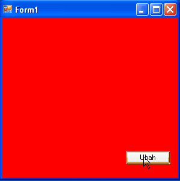

# Tugas Pengenalan Properties & Event

## Soal
Buatlah sebuah aplikasi Windows Form sederhana dengan Properties Backcolor biru,
yang berubah warna menjadi merah ketika tombol ubah ditekan. Dan berubah kembali
menjadi biru, ketika tombol ubah ditekan kembali. *Catatan: dapat menggunakan
warna lain.*

## Petunjuk
Gunakan Properties Backcolor dan variabel Me

## Cara Pengerjaan
- Buatlah sebuah project baru dengan visual studio dan simpan dengan nama **project** ke dalam directory ini.
- Ubah file [pernyataan.txt](./pernyataan.txt), isi NIM, nama lengkap serta kelas.
- Kerjakan tugas sesuai dengan deskripsi soal.
- Lakukan perintah git
  - git add
  - git commit
  - git push
